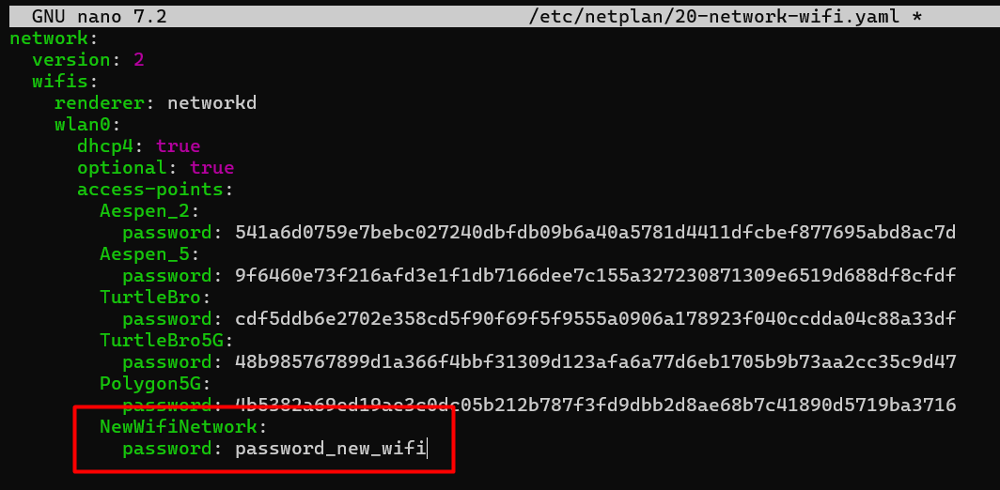

# Настройка подключения к Wi‑Fi

## Подключение к точке Wi‑Fi по умолчанию

При первом запуске **BRover-E5** автоматически пытается подключиться к заранее настроенной сети:

```yaml
SSID: TurtleBro
password: turtlew001
```

или

```yaml
SSID: TurtleBro5G
password: turtlew001
```

---


## Настройка подключения к другой Wi‑Fi-сети

Если необходимо подключить ровер к другой сети, отредактируйте конфигурацию Netplan.

1. Подключитесь к роверу по SSH

2. Откройте файл конфигурации:

```bash
sudo nano /etc/netplan/20-network-wifi.yaml
```

3. Добавьте параметры вашей Wi‑Fi-сети в секцию `access-points` интерфейса `wlan0`.

Пример конфигурации:

```yaml
network:
  version: 2
  wifis:
    renderer: networkd
    wlan0:
      dhcp4: true
      optional: true
      access-points:
        TurtleBro:
          password: turtlew001
        TurtleBro5G:
          password: turtlew001
        NewWiFiNetwork:
          password: password_new_wifi
```



4. Сохраните файл:

```text
Ctrl + S → Ctrl + X
```

5. Примените настройки:

```bash
sudo netplan apply
```

или перезагрузите устройство:

```bash
sudo reboot
```

---

:::warning[Внимание]

* файл `/etc/netplan/20-network-wifi.yaml`, как и любой YAML‑файл, **очень чувствителен к отступам**;
* запрещено использовать символы табуляции (`Tab`);
* для отступов используйте **только пробелы**;
* неправильные отступы приведут к ошибке применения конфигурации сети.
:::

---

## Настройка подключения через microSD-карту

Этот способ используется, если нет доступа к устройству по SSH.

На microSD-карте, содержащей готовый образ для запуска на роботе, есть два раздела разного размера. Обычно они называются `system-boot` и `writable`, но в некоторых случаях система может присвоить им другие имена при подключении к компьютеру:

- **system-boot** (FAT32)  
  - Небольшой раздел (несколько сотен МБ), необходимый для загрузки.  
  - Содержит:
    - Файлы загрузчика (`bootloader.bin`, `start*.elf` и др.)
    - Ядро Linux (`vmlinuz`)
    - Initramfs (`initrd.img`)
    - Конфигурационные файлы (`config.txt`, `cmdline.txt`, `network-config`)
  - Доступен для чтения на любом компьютере.

- **writable** (ext4)  
  - Основной раздел, занимающий большую часть SD-карты.
  - Содержит корневую файловую систему Ubuntu (`/`, `/home`, `/var` и т. д.).  
  - Здесь хранятся все пользовательские данные, установленные программы и настройки системы.  
  - При подключении к ПК может не отображаться автоматически, потому что Windows обычно не открывает ext4 без дополнительных средств. Раздел доступен в Linux или через специальные драйверы для Windows.

:::note
**Важно:** В этом способе изменяется файл на разделе `writable`. При ручном изменении системных файлов соблюдайте осторожность — ошибки могут привести к невозможности загрузки системы.
:::

### Порядок действий

1. Извлеките microSD-карту из ровера и подключите её к компьютеру

2. Откройте раздел `writable` и перейдите к файлу:

```bash
/etc/netplan/20-network-wifi.yaml
```

3. Откройте файл в редакторе и добавьте новую сеть в `wlan0`

Пример:

```yaml
network:
  version: 2
  wifis:
    renderer: networkd
    wlan0:
      dhcp4: true
      optional: true
      access-points:
        TurtleBro:
          password: turtlew001
        TurtleBro5G:
          password: turtlew001
        NewWiFiNetwork:
          password: password_new_wifi
```

4. Сохраните файл и безопасно извлеките microSD-карту

5. Вставьте карту обратно в ровер и включите его

---

## Если подключение не удалось

Если после изменения настроек ровер не подключается к сети:

* проверьте корректность SSID и пароля
* убедитесь в правильности отступов в YAML-файле
* подключитесь по SSH через Ethernet (если доступно) и исправьте конфигурацию

---
