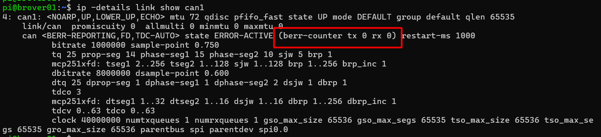

# Работа с CAN на роботе

На платформе **BRover E5** используется шина **CAN (Controller Area Network)** — промышленный протокол обмена данными между устройствами в реальном времени. Он широко применяется в робототехнике, автомобилях и встраиваемых системах благодаря своей надёжности, устойчивости к помехам и детерминированному поведению.

CAN позволяет объединять контроллеры, датчики и исполнительные устройства в единую сеть, где каждое устройство может передавать и принимать сообщения без центрального управляющего узла.

---

## CAN-интерфейсы на роботе

На Raspberry Pi, установленной в BRover E5, доступны два CAN-интерфейса:

### can0 — системный интерфейс

Интерфейс `can0` используется **внутренними компонентами робота**:

* связь с драйверами моторов
* обмен данными с контроллерами платформы
* управление движением и телеметрией

---

### can1 — пользовательский интерфейс

Интерфейс `can1` предназначен для **подключения внешних устройств** и разработки собственных решений.

Через него можно:

* подключать датчики и микроконтроллеры
* отправлять и принимать CAN-сообщения
* интегрировать CAN с ROS 2 (через ноды-посредники)
* реализовывать собственные протоколы обмена

Этот интерфейс полностью изолирован от системного (`can0`) и безопасен для экспериментов.

---

## Параметры CAN-шины

На роботе используется расширенный режим **CAN FD (Flexible Data-rate)**, который позволяет передавать больше данных за одно сообщение по сравнению с классическим CAN.

Основные параметры:

* **Тип:** CAN FD
* **Bitrate (арбитражная скорость):** 1 000 000 бит/с
* **Dbitrate (скорость передачи данных):** 8 000 000 бит/с

Интерфейсы обычно запускаются автоматически при загрузке системы.

---

## Ручное управление интерфейсом

Если необходимо вручную включить интерфейс `can1`:

```bash
sudo ip link set can1 up txqueuelen 65535 type can bitrate 1000000 dbitrate 8000000 fd on
```

Пояснение параметров:

* `bitrate` — скорость арбитража (основной канал управления)
* `dbitrate` — скорость передачи данных в режиме CAN FD
* `fd on` — включает режим CAN FD

Отключение интерфейса:

```bash
sudo ifconfig can1 down
```

---

## Утилиты для работы с CAN

В системе предустановлен пакет **can-utils** — стандартный набор инструментов для диагностики и работы с CAN.

### Отправка сообщений

```bash
cansend can1 <ID>#<DATA>
```

* `<ID>` — идентификатор сообщения (в hex)
* `<DATA>` — полезная нагрузка

Используется **расширенный 29-битный идентификатор**, поэтому ID обычно задаётся 8 hex-символами.

Пример:

```bash
cansend can1 00000012#DEADBEEF
```

---

### Прослушивание шины

Чтобы увидеть все сообщения:

```bash
candump can1
```

Фильтрация по ID:

```bash
candump can1,0x12:7ff
```

Это полезно при отладке, когда необходимо отслеживать конкретные сообщения.

---

### Проверка состояния интерфейса

```bash
ip -details link show can1
```

Команда выводит:

* текущее состояние интерфейса
* режим работы (включён ли CAN FD)
* статистику передачи
* счётчики ошибок

Если система работает корректно — счётчики ошибок будут равны 0.



---

## Как правильно тестировать CAN

Работа CAN-шины имеет важную особенность: **сообщение считается доставленным только при наличии подтверждения (ACK)** от другого устройства.

### ❌ Неправильный способ

Отправка и приём на одном интерфейсе:

```bash
cansend can1 00000012#DEADBEEF
candump can1
```

В этом случае вы можете увидеть сообщение, но это не гарантирует, что оно действительно прошло по шине.

Причина — механизм *loopback* (эхо), при котором драйвер может отразить отправленный кадр обратно.

---

### ✅ Правильные способы

#### Вариант 1: два интерфейса (временно)

Соедините `can0` и `can1` физически:

* CAN_H → CAN_H
* CAN_L → CAN_L

И выполните:

* отправка в `can1`
* приём в `can0`

---

#### Вариант 2: внешнее устройство

Подключите отдельный CAN-узел:

* микроконтроллер
* CAN-модуль
* другое устройство

Если сообщения успешно принимаются другим устройством — шина работает корректно.

---

## Практические рекомендации

* всегда используйте `can1` для пользовательских задач
* проверяйте параметры шины перед подключением устройств
* избегайте работы с CAN без второго узла (это даёт ложные результаты)
* при интеграции с ROS 2 используйте отдельные ноды для преобразования CAN ↔ ROS

---