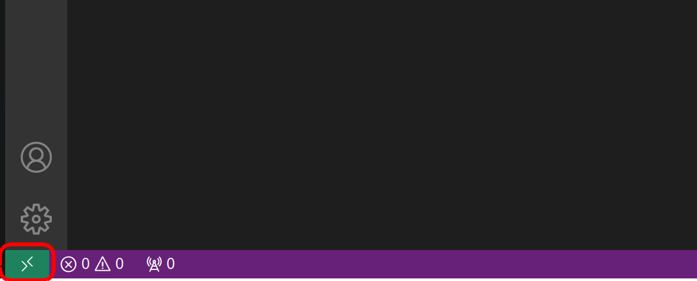
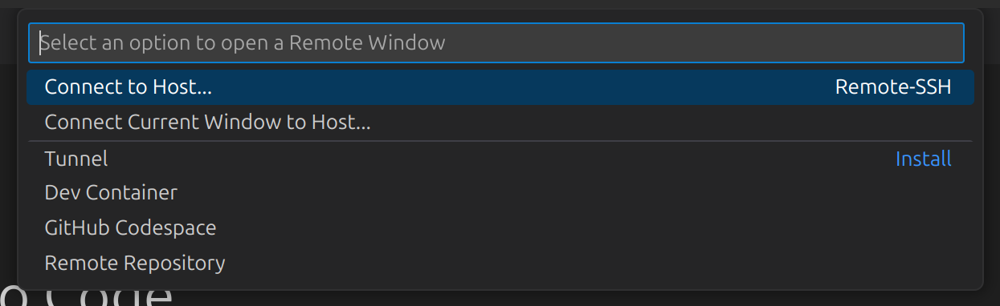
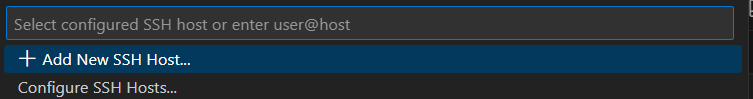
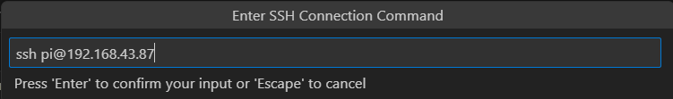
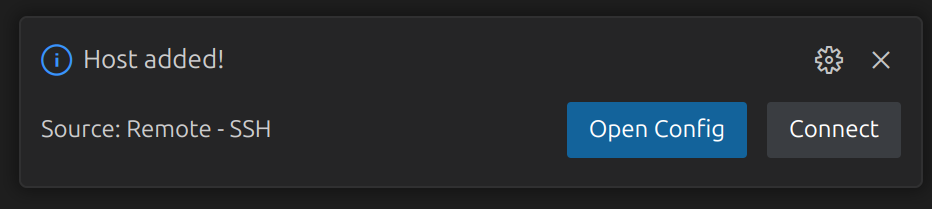

---

id: 20-vscode-code-server-connection
slug: vscode-code-server-connection
title: "Подключение через VS Code и code-server"
sidebar_label: "VS Code / code-server"
sidebar_position: 4
description: "Подключение к BRover-E5 через браузер (code-server) и VS Code Remote-SSH"
---

# Подключение через VS Code и code-server

Для разработки и работы с файлами на **BRover-E5** доступны два удобных варианта:

* **code-server (через браузер)** — быстрый доступ без установки
* **VS Code + Remote-SSH** — полноценная локальная IDE с удалённым доступом

---

## Подключение через code-server (браузер)

На ровере запущен веб-сервис **code-server**, который предоставляет VS Code прямо в браузере.

1. Убедитесь, что компьютер и ровер находятся в одной сети
2. Откройте браузер
3. Перейдите по адресу:

```text
http://broverXX.local:8090
```

или используйте IP-адрес:

```text
http://<IP-адрес>:8090
```

4. Введите пароль (если запрашивается)

После подключения откроется интерфейс VS Code, работающий напрямую на ровере.

Вы можете:

* редактировать файлы
* запускать терминал
* работать с ROS-пакетами

---

## Подключение через VS Code (Remote-SSH)

Процесс настройки VS Code одинаков на всех операционных системах.

1. **Откройте VS Code**
2. В левом нижнем углу окна нажмите **Open a Remote Window** <br />
   _При первом использовании потребуется установка расширения **Remote - SSH**_



3. В появившемся меню выберите **Connect to Host → Add New SSH Host**





4. В строке ввода введите команду:

```bash
ssh pi@<IP-адрес ровера>
```

и нажмите *Enter*



5. Выберите SSH-config файл для сохранения хоста

6. Введите пароль `brobro`

7. Если всё выполнено правильно, в правом нижнем углу появится окно:



8. Нажмите *Connect*, чтобы подключиться к роверу

9. После подключения начнётся установка VS Code Server на устройстве

10. После завершения установки вы сможете работать с файловой системой ровера

11. Для повторного подключения используйте:

```text
Open a Remote Window → Connect to Host → IP-адрес ровера
```
---
